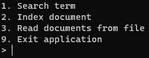

# Search Engine App

A command line implementation of a simple search engine based on TF*IDF algorithm.


## Usage

* Launch the output jar file from command line:  
``` java -jar SearchEngineApp-1.0-SNAPSHOT-jar-with-dependencies.jar```  
A main menu will show, like below:

  

Selection of a specific option is being done by entering it's number.  
After command execution program returns to the main menu (unless it was an exit command)

* For indexing by menu option, select option 1. You will be prompted for document ID and it's content  

  

* Alternatively, it is possible to read set of documents from a JSON file

  

* In order to make a search query, select option 3, and type the keyword.

  

Output consists of document IDs along with their tf*idf score.

* Exit the aplication by selecting option 9.

## Side notes
- Example in the provided task contains a mistake in the output for "fox" keyword:  
Wrong order of documents. Document 3 has higher tf-idf score than document 1
and should've been first. That is because "fox" appears in both documents, but document 3 contains fewer words.
That makes document 3 more relevant for given keyword.

- The example output does not contain tf-idf scores as specified in requirements.